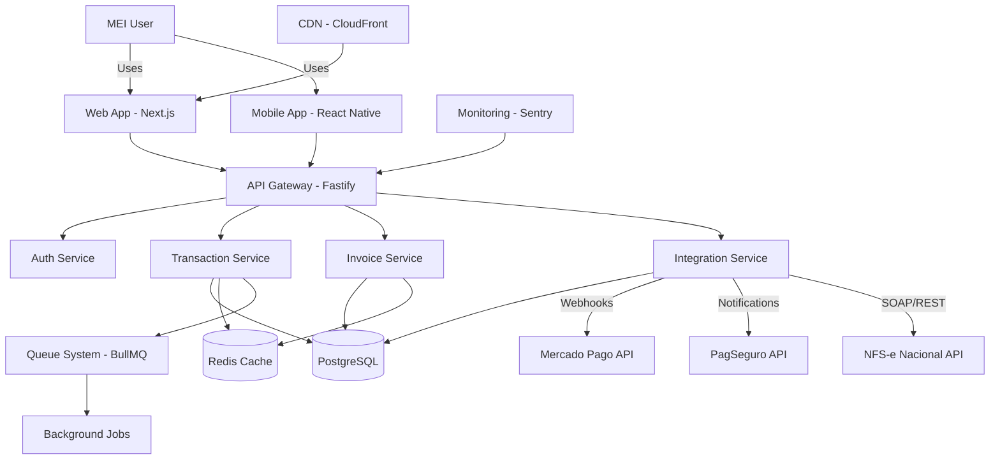

# PRD: ERP Financeiro para MEI com Expansão E-commerce

## 📋 Document Information
- **Product Name**: FinanceiroMEI
- **Version**: 1.0
- **Created**: 2025-08-10
- **Product Owner**: Lucas Cardoso
- **Target Market**: Microempreendedores Individuais (MEI) - Brasil

---

## 🎯 **EXECUTIVE SUMMARY**

### **Visão do Produto**
Sistema integrado de gestão financeira para microempreendedores brasileiros que evolui para plataforma completa de e-commerce, oferecendo automação total do fluxo: **venda → pagamento → nota fiscal → conciliação bancária**.

### **Problema a Resolver**
- **97% das empresas brasileiras são MEIs** que lutam com gestão financeira manual
- **Fragmentação de ferramentas**: Mercado Pago, PagSeguro, planilhas, sites das prefeituras
- **NFS-e obrigatória** desde setembro/2023, mas processo ainda é manual
- **Falta de visão integrada** entre vendas, pagamentos e obrigações fiscais

### **Solução Proposta**
Plataforma única que integra:
1. **Gestão Financeira Automática** (Mercado Pago + PagSeguro + bancos)
2. **Emissão Automática de NFS-e** (integração direta com prefeituras)
3. **E-commerce Nativo** (expansão futura com checkout integrado)

### **Diferencial Competitivo**
- **Única solução** que une gestão financeira + fiscal + e-commerce
- **Automação completa** do ciclo de vendas MEI
- **APIs nativas** com principais players brasileiros
- **Expansão natural** de ERP para e-commerce

---

## 🚀 **PRODUCT ROADMAP**

### **FASE 1: MVP ERP Financeiro (0-3 meses)**
**Objetivo**: Validar mercado com funcionalidades core de gestão financeira

**Core Features**:
- ✅ Dashboard financeiro unificado
- ✅ Integração Mercado Pago (API + Webhooks)
- ✅ Integração PagSeguro (API + Notificações)
- ✅ Emissão manual NFS-e Nacional
- ✅ Conciliação bancária básica
- ✅ Controle de fluxo de caixa em tempo real

**Success Metrics**:
- 100+ MEIs cadastrados
- 1.000+ transações processadas
- 90%+ uptime
- NPS > 50

### **FASE 2: Automação Completa (3-6 meses)**
**Objetivo**: Automatizar completamente o processo fiscal e financeiro

**Advanced Features**:
- ✅ Emissão automática NFS-e pós-venda
- ✅ Conciliação bancária em tempo real
- ✅ Relatórios gerenciais avançados
- ✅ Alertas inteligentes (impostos, prazos, fluxo)
- ✅ API pública para integrações terceiras
- ✅ Mobile app (iOS + Android)

**Success Metrics**:
- 1.000+ MEIs pagantes
- 95%+ automação fiscal
- Churn < 5% mensal
- NPS > 70

### **FASE 3: E-commerce Integrado (6-12 meses)**
**Objetivo**: Expandir para plataforma completa de vendas online

**E-commerce Module**:
- 🛍️ Catálogo de produtos integrado
- 💳 Checkout nativo com pagamentos
- 📦 Controle de estoque sincronizado
- 🎨 Templates responsivos customizáveis
- 🔍 SEO otimizado
- 📱 PWA (Progressive Web App)

**Success Metrics**:
- 500+ lojas online ativas
- R$ 1M+ GMV mensal
- 10%+ conversion rate médio
- 95%+ mobile compatibility

### **FASE 4: Ecossistema Completo (12-18 meses)**
**Objetivo**: Tornar-se plataforma dominante para MEI no Brasil

**Platform Features**:
- 🏪 Marketplace multi-tenant
- 🚚 Logística integrada (Correios + transportadoras)
- 📧 Marketing automation (email, SMS, WhatsApp)
- 📊 BI/Analytics avançado com IA
- 🔌 Apps marketplace para parceiros
- 🤖 Assistente virtual com IA

**Success Metrics**:
- 10.000+ MEIs ativos
- R$ 10M+ GMV mensal
- 50+ parceiros no marketplace
- NPS > 80

---

## 👥 **TARGET AUDIENCE**

### **Perfil Primário: MEI Ativo Digital**
- **Demografia**: 25-45 anos, classe B/C
- **Comportamento**: Vende online, usa Mercado Pago/PagSeguro
- **Dores**: Controle financeiro manual, NFS-e complexa
- **Motivações**: Crescer o negócio, profissionalizar gestão

**Tamanho do mercado**: ~5 milhões de MEIs ativos digitalmente

### **Perfil Secundário: MEI Tradicional em Transição**
- **Demografia**: 35-55 anos, classe C/D
- **Comportamento**: Vendas presenciais, quer digitalizar
- **Dores**: Medo da tecnologia, processos manuais
- **Motivações**: Competir no digital, facilitar operação

**Tamanho do mercado**: ~10 milhões de MEIs em transição

### **Anti-Personas**
- Grandes empresas (já têm ERPs robustos)
- MEIs sem movimento digital (sem pagamentos eletrônicos)
- Profissionais liberais complexos (médicos, advogados)

---

## 💼 **BUSINESS MODEL**

### **Modelo de Monetização**

#### **Freemium Strategy**
```
🆓 GRATUITO (sempre gratuito)
- Até 50 transações/mês
- Dashboard básico
- 1 integração (Mercado Pago OU PagSeguro)
- Emissão manual NFS-e (5/mês)

💼 PROFISSIONAL (R$ 29,90/mês)
- Até 500 transações/mês
- Todas as integrações
- Emissão automática NFS-e (ilimitada)
- Conciliação automática
- Relatórios avançados
- Suporte prioritário

🚀 PREMIUM (R$ 49,90/mês)
- Transações ilimitadas
- E-commerce integrado
- Templates premium
- Marketing automation básico
- API personalizada
- Multi-usuários (até 3)

🏢 ENTERPRISE (R$ 99,90/mês)
- Tudo do Premium +
- BI/Analytics com IA
- Marketplace de apps
- Suporte dedicado
- White-label
- Multi-empresas (até 10)
```

#### **Revenue Streams Adicionais**
1. **Transaction Fee**: 0,5% sobre vendas e-commerce (apenas Premium+)
2. **Apps Marketplace**: 30% revenue share com desenvolvedores
3. **Serviços Profissionais**: Setup, migração, treinamento
4. **Partnerships**: Comissões por indicação de serviços financeiros

### **Projeção Financeira (18 meses)**

| Mês | Usuários | Pagantes | MRR | ARR |
|-----|----------|----------|-----|-----|
| 3   | 500      | 50       | R$ 1.500 | R$ 18K |
| 6   | 2.000    | 300      | R$ 12.000 | R$ 144K |
| 12  | 8.000    | 1.500    | R$ 60.000 | R$ 720K |
| 18  | 20.000   | 4.000    | R$ 180.000 | R$ 2,16M |

**Break-even**: Mês 8
**ROI Break-even**: Mês 14

---

## 🏗️ **TECHNICAL ARCHITECTURE**

### **Technology Stack**

#### **Backend Stack**
```typescript
// Core Backend
- Runtime: Node.js 20+ (TypeScript)
- Framework: Fastify (performance-first)
- Database: PostgreSQL 15+ (production) + Redis (cache)
- ORM: Prisma (type-safe, migration-friendly)
- Queue: BullMQ (background jobs)
- Auth: JWT + refresh tokens
```

#### **Frontend Stack**
```typescript
// Web Application
- Framework: Next.js 15 (App Router)
- Language: TypeScript (strict mode)
- UI: Tailwind CSS + Radix UI (shadcn/ui)
- State: Zustand (global) + TanStack Query (server)
- Forms: React Hook Form + Zod validation
- Charts: Recharts + D3.js (advanced)
```

#### **Mobile Stack**
```typescript
// Mobile Apps (Fase 2)
- Framework: React Native (Expo SDK 53+)
- Navigation: React Navigation 7
- State: Zustand (shared with web)
- Storage: MMKV (high-performance)
- Push: Expo Notifications
```

#### **Infrastructure**
```yaml
# Cloud & DevOps
Production: AWS (multi-AZ)
  - Compute: ECS Fargate (auto-scaling)
  - Database: RDS PostgreSQL (Multi-AZ)
  - Cache: ElastiCache Redis
  - Storage: S3 + CloudFront CDN
  - Queue: SQS + EventBridge

Development: Docker + Docker Compose
CI/CD: GitHub Actions
Monitoring: Sentry + Grafana + Prometheus
Analytics: Mixpanel + Google Analytics
```

### **System Architecture Diagram**



### **Database Schema (Core Tables)**

```sql
-- Usuarios
CREATE TABLE users (
    id UUID PRIMARY KEY DEFAULT gen_random_uuid(),
    email VARCHAR(255) UNIQUE NOT NULL,
    password_hash VARCHAR(255) NOT NULL,
    name VARCHAR(255) NOT NULL,
    cpf_cnpj VARCHAR(20) UNIQUE NOT NULL,
    phone VARCHAR(20),
    subscription_plan subscription_plan_enum DEFAULT 'free',
    created_at TIMESTAMP WITH TIME ZONE DEFAULT NOW(),
    updated_at TIMESTAMP WITH TIME ZONE DEFAULT NOW()
);

-- Integrações
CREATE TABLE integrations (
    id UUID PRIMARY KEY DEFAULT gen_random_uuid(),
    user_id UUID NOT NULL REFERENCES users(id) ON DELETE CASCADE,
    provider integration_provider_enum NOT NULL,
    access_token TEXT,
    refresh_token TEXT,
    webhook_url TEXT,
    is_active BOOLEAN DEFAULT true,
    last_sync TIMESTAMP WITH TIME ZONE,
    created_at TIMESTAMP WITH TIME ZONE DEFAULT NOW(),
    UNIQUE(user_id, provider)
);

-- Transações
CREATE TABLE transactions (
    id UUID PRIMARY KEY DEFAULT gen_random_uuid(),
    user_id UUID NOT NULL REFERENCES users(id) ON DELETE CASCADE,
    integration_id UUID REFERENCES integrations(id),
    external_id VARCHAR(255),
    type transaction_type_enum NOT NULL,
    amount DECIMAL(15,2) NOT NULL,
    description TEXT,
    category VARCHAR(100),
    payment_method VARCHAR(50),
    status transaction_status_enum DEFAULT 'pending',
    processed_at TIMESTAMP WITH TIME ZONE,
    created_at TIMESTAMP WITH TIME ZONE DEFAULT NOW(),
    INDEX idx_user_date (user_id, created_at),
    INDEX idx_external_id (external_id)
);

-- Notas Fiscais
CREATE TABLE invoices (
    id UUID PRIMARY KEY DEFAULT gen_random_uuid(),
    user_id UUID NOT NULL REFERENCES users(id) ON DELETE CASCADE,
    transaction_id UUID REFERENCES transactions(id),
    invoice_number VARCHAR(50),
    municipal_code VARCHAR(10),
    service_code VARCHAR(20),
    gross_amount DECIMAL(15,2) NOT NULL,
    net_amount DECIMAL(15,2) NOT NULL,
    tax_amount DECIMAL(15,2) NOT NULL,
    description TEXT,
    customer_name VARCHAR(255),
    customer_document VARCHAR(20),
    status invoice_status_enum DEFAULT 'draft',
    xml_content TEXT,
    pdf_url TEXT,
    issued_at TIMESTAMP WITH TIME ZONE,
    created_at TIMESTAMP WITH TIME ZONE DEFAULT NOW()
);
```

---

## 🔌 **API INTEGRATIONS**

### **Mercado Pago Integration**

#### **Webhook Configuration**
```typescript
// Webhook handler para transações em tempo real
POST /webhooks/mercadopago

interface MercadoPagoWebhook {
  id: number;
  live_mode: boolean;
  type: 'payment' | 'plan' | 'subscription' | 'invoice';
  date_created: string;
  application_id: number;
  user_id: string;
  version: number;
  api_version: string;
  action: 'payment.created' | 'payment.updated';
  data: {
    id: string; // Payment ID to fetch details
  };
}

// Process webhook
1. Validate signature with webhook secret
2. Fetch full payment details via API
3. Update transaction in database
4. Trigger NFS-e emission if needed
5. Send notification to user
6. Return HTTP 200 (required by Mercado Pago)
```

#### **API Endpoints Used**
```typescript
// Principais endpoints da API do Mercado Pago
GET /v1/payments/{payment_id} // Detalhes do pagamento
GET /v1/payments/search // Buscar pagamentos
GET /v1/payment_methods // Métodos de pagamento disponíveis
POST /v1/payments // Criar pagamento (futuro e-commerce)
```

### **PagSeguro/PagBank Integration**

#### **Notification Handler**
```typescript
// Handler para notificações do PagSeguro
POST /webhooks/pagseguro

interface PagSeguroNotification {
  notificationCode: string;
  notificationType: 'transaction';
}

// Process notification
1. Receive notification with code
2. Fetch transaction details via API
3. Update local transaction record
4. Process status changes (pending → approved)
5. Trigger business logic (NFS-e, notifications)
6. Return HTTP 200
```

#### **API Endpoints Used**
```typescript
// Principais endpoints da API do PagSeguro
GET /v4/transactions/{transaction_id} // Detalhes da transação
GET /v4/orders/{order_id} // Detalhes do pedido
POST /v4/orders // Criar pedido (futuro)
GET /v4/accounts/{account_id}/transactions // Listar transações
```

### **NFS-e Nacional Integration**

#### **API Configuration**
```typescript
// Integração com NFS-e Nacional (gov.br)
interface NFSeConfig {
  municipalCode: string; // Código do município
  cnpj: string; // CNPJ do emitente
  inscricaoMunicipal: string; // Inscrição municipal
  certificateP12: Buffer; // Certificado digital A1
  certificatePassword: string; // Senha do certificado
  environment: 'sandbox' | 'production';
}

// Emission flow
1. Validate service data
2. Generate XML according to nacional standard
3. Sign XML with digital certificate
4. Send to municipal webservice
5. Receive RPS number and XML signed
6. Store XML and generate PDF
7. Send to customer via email
```

#### **Supported Operations**
```typescript
// Operações suportadas pela API NFS-e
POST /nfse/gerar // Gerar nova nota fiscal
GET /nfse/consultar/{numero} // Consultar nota emitida  
POST /nfse/cancelar // Cancelar nota fiscal
GET /nfse/pdf/{numero} // Download PDF da nota
```

---

## 🎨 **USER EXPERIENCE & DESIGN**

### **User Journey Map**

#### **Onboarding Journey (Novo MEI)**
```
1. 🔍 Descoberta (Google, indicação, ads)
   ↓
2. 📝 Cadastro (email + dados MEI)
   ↓  
3. 🔌 Integração (conectar Mercado Pago/PagSeguro)
   ↓
4. 📊 Primeiro dashboard (dados reais importados)
   ↓
5. 🧾 Primeira NFS-e (assistida)
   ↓
6. ✅ Ativação (valor percebido alcançado)
```

#### **Daily Usage Journey (MEI Ativo)**
```
1. 📱 Abrir app/site (push notification ou rotina)
   ↓
2. 👀 Dashboard overview (vendas do dia, pendências)
   ↓
3. 🔄 Sync automático (transações atualizadas)
   ↓
4. ⚡ Ações rápidas (aprovar NFS-e, ver fluxo de caixa)
   ↓
5. 📈 Insights (relatórios, trends, alertas)
   ↓
6. ✅ Tarefas concluídas (notificações cleared)
```

### **Key Screens & Wireframes**

#### **Dashboard Principal**
```
┌─────────────────────────────────────────────┐
│ FinanceiroMEI                    [👤] [🔔] │
├─────────────────────────────────────────────┤
│                                             │
│ 💰 Saldo Atual: R$ 15.847,32               │
│ 📈 Vendas (Mês): R$ 23.450,00 (+12%)      │
│ 🧾 NFS-e Pendentes: 3                      │
│                                             │
├─────────────────────────────────────────────┤
│                                             │
│ 📊 [Gráfico Fluxo de Caixa - 30 dias]     │
│                                             │
├─────────────────────────────────────────────┤
│                                             │
│ 🔥 Ações Rápidas                           │
│ [🧾 Emitir NFS-e] [📄 Relatórios]         │
│ [🔄 Sincronizar] [⚙️ Integrações]          │
│                                             │
├─────────────────────────────────────────────┤
│                                             │
│ 📋 Últimas Transações                      │
│ • Mercado Pago - R$ 450,00 - Aprovado     │
│ • PagSeguro - R$ 120,00 - Pendente        │
│ • PIX - R$ 890,00 - Aprovado              │
│                                             │
└─────────────────────────────────────────────┘
```

#### **Emissão NFS-e Automática**
```
┌─────────────────────────────────────────────┐
│ ← Nova Nota Fiscal                          │
├─────────────────────────────────────────────┤
│                                             │
│ 🎯 Transação Selecionada                   │
│ Mercado Pago - R$ 450,00                   │
│ Cliente: João Silva (CPF: 123.456.789-00)  │
│                                             │
├─────────────────────────────────────────────┤
│                                             │
│ 📋 Dados do Serviço                        │
│ Descrição: [Design de Logo Empresarial   ] │
│ Código Serviço: [07.02 - Publicidade    ▼] │
│ Alíquota ISS: [2%] (Auto-detectada)       │
│                                             │
├─────────────────────────────────────────────┤
│                                             │
│ 💰 Valores                                  │
│ Valor Bruto: R$ 450,00                     │
│ ISS (2%): R$ 9,00                          │
│ Valor Líquido: R$ 441,00                   │
│                                             │
├─────────────────────────────────────────────┤
│                                             │
│ [🚫 Cancelar]              [✅ Emitir NFS-e] │
│                                             │
└─────────────────────────────────────────────┘
```

### **Design System**

#### **Color Palette**
```scss
// Primary Colors (Azul Confiança)
--primary-50: #eff6ff
--primary-500: #3b82f6  // Main brand color
--primary-600: #2563eb  // Hover states
--primary-900: #1e3a8a  // Text/headers

// Success (Verde Dinheiro)
--success-50: #f0fdf4
--success-500: #22c55e
--success-900: #14532d

// Warning (Amarelo Atenção)  
--warning-50: #fefce8
--warning-500: #eab308
--warning-900: #854d0e

// Error (Vermelho Urgência)
--error-50: #fef2f2
--error-500: #ef4444
--error-900: #7f1d1d
```

#### **Typography**
```scss
// Font Stack
font-family: 'Plus Jakarta Sans Variable', system-ui, sans-serif

// Font Scales
--text-xs: 0.75rem    // 12px - Labels, captions
--text-sm: 0.875rem   // 14px - Body text, forms
--text-base: 1rem     // 16px - Default body
--text-lg: 1.125rem   // 18px - Large body, cards
--text-xl: 1.25rem    // 20px - Section headers
--text-2xl: 1.5rem    // 24px - Page titles
--text-3xl: 1.875rem  // 30px - Marketing headers
```

#### **Component Guidelines**
```typescript
// Button System
interface ButtonProps {
  variant: 'primary' | 'secondary' | 'ghost' | 'destructive'
  size: 'sm' | 'md' | 'lg'
  loading?: boolean
  icon?: React.ReactNode
}

// Examples
<Button variant="primary" size="lg">Emitir NFS-e</Button>
<Button variant="ghost" size="sm" icon={<SyncIcon />}>Sincronizar</Button>
```

---

## 📝 **USER STORIES & ACCEPTANCE CRITERIA**

### **Epic 1: Gestão Financeira Automatizada**

#### **User Story 1.1: Integração Mercado Pago**
```gherkin
Feature: Integração com Mercado Pago
  Como MEI que vende online
  Eu quero conectar minha conta do Mercado Pago
  Para que minhas vendas sejam importadas automaticamente

Scenario: Conectar conta Mercado Pago com sucesso
  Given que sou um MEI cadastrado no sistema
  And estou na página de integrações
  When clico em "Conectar Mercado Pago"
  And autorizo o acesso na página do Mercado Pago
  And retorno para o sistema
  Then vejo a mensagem "Mercado Pago conectado com sucesso"
  And vejo o status "Conectado" na integração
  And minhas transações são importadas automaticamente

Scenario: Falha na conexão por credenciais inválidas
  Given que sou um MEI cadastrado no sistema
  And estou tentando conectar o Mercado Pago
  When forneço credenciais inválidas
  Then vejo a mensagem de erro "Credenciais inválidas"
  And a integração permanece desconectada
  And posso tentar novamente

Scenario: Recebimento de webhook de nova venda
  Given que tenho Mercado Pago conectado
  When uma nova venda é processada no Mercado Pago
  And o webhook é enviado para nosso sistema
  Then a transação é criada automaticamente
  And recebo notificação no app
  And vejo a transação no dashboard em até 30 segundos
```

#### **User Story 1.2: Dashboard Financeiro Unificado**
```gherkin
Feature: Dashboard Financeiro Unificado
  Como MEI
  Eu quero visualizar todas minhas transações em um só lugar
  Para ter controle total do meu fluxo de caixa

Scenario: Visualizar dashboard com dados atualizados
  Given que tenho integrações ativas
  And possuo transações nos últimos 30 dias
  When acesso o dashboard principal
  Then vejo meu saldo atual atualizado
  And vejo as vendas do mês com percentual de crescimento
  And vejo gráfico de fluxo de caixa dos últimos 30 dias
  And vejo lista das últimas transações

Scenario: Dashboard sem transações (usuário novo)
  Given que sou um MEI recém-cadastrado
  And não possuo transações ainda
  When acesso o dashboard
  Then vejo estado vazio com orientações
  And vejo botões para conectar integrações
  And vejo tutorial de primeiros passos

Scenario: Atualização em tempo real via websocket
  Given que estou visualizando o dashboard
  When uma nova transação é recebida via webhook
  Then vejo a transação aparecer na lista em tempo real
  And o saldo atual é atualizado automaticamente
  And recebo notificação visual discreta
```

### **Epic 2: Emissão Automática de NFS-e**

#### **User Story 2.1: Emissão Manual de NFS-e**
```gherkin
Feature: Emissão Manual de NFS-e
  Como MEI
  Eu quero emitir notas fiscais de serviço facilmente
  Para cumprir minhas obrigações fiscais

Scenario: Emitir NFS-e baseada em transação existente
  Given que tenho uma transação aprovada de R$ 450,00
  And o cliente informou CPF válido
  When clico em "Emitir NFS-e" para essa transação
  And preencho a descrição do serviço
  And seleciono o código do serviço (07.02)
  And confirmo os dados
  Then a nota fiscal é gerada com sucesso
  And recebo o número da NFS-e
  And o PDF é gerado automaticamente
  And a nota é enviada por email para o cliente
  And o status da transação muda para "Com NFS-e"

Scenario: Emissão com dados incompletos
  Given que estou emitindo uma NFS-e
  When deixo campos obrigatórios em branco
  And tento confirmar a emissão
  Then vejo mensagens de erro específicas
  And os campos obrigatórios são destacados
  And a nota não é emitida

Scenario: Falha na comunicação com a Prefeitura
  Given que estou emitindo uma NFS-e
  When o sistema da prefeitura está fora do ar
  And tento emitir a nota
  Then vejo mensagem "Sistema da prefeitura indisponível"
  And a nota fica em fila para reprocessamento
  And sou notificado quando a emissão for concluída
```

#### **User Story 2.2: Automação da Emissão NFS-e**
```gherkin
Feature: Emissão Automática de NFS-e
  Como MEI que vende regularmente
  Eu quero que as notas fiscais sejam emitidas automaticamente
  Para economizar tempo e garantir compliance

Scenario: Configurar automação para tipo de serviço
  Given que sou um MEI com plano Pro ou superior
  And estou na página de configurações fiscais
  When configuro emissão automática
  And defino código de serviço padrão (07.02)
  And defino descrição padrão "Serviços de Design"
  And ativo a automação
  Then novas transações deste tipo geram NFS-e automaticamente
  And sou notificado apenas do resultado

Scenario: Emissão automática após aprovação de pagamento
  Given que tenho automação configurada
  When uma transação é aprovada no Mercado Pago
  And o valor é superior ao mínimo configurado
  And o cliente tem CPF/CNPJ válido
  Then NFS-e é emitida automaticamente em até 5 minutos
  And cliente recebe a nota por email
  And sou notificado do sucesso
  And posso visualizar a nota no dashboard

Scenario: Falha na emissão automática com retry
  Given que uma emissão automática falhou
  When o sistema tenta reprocessar a nota
  And a falha persiste após 3 tentativas
  Then sou notificado da falha
  And a transação fica marcada como "NFS-e Pendente"
  And posso emitir manualmente como fallback
```

### **Epic 3: Conciliação Bancária Automática**

#### **User Story 3.1: Conciliação Automática de Transações**
```gherkin
Feature: Conciliação Bancária Automática
  Como MEI
  Eu quero que minhas vendas sejam automaticamente conciliadas com meu extrato
  Para ter certeza de que tudo que vendi realmente caiu na conta

Scenario: Conciliação automática bem-sucedida
  Given que vendo R$ 500 via Mercado Pago hoje
  And o Mercado Pago desconta R$ 25 de taxa (5%)
  When o dinheiro cai na minha conta (R$ 475)
  And o sistema recebe confirmação via API
  Then a transação é automaticamente conciliada
  And vejo status "Conciliado" na transação
  And o valor líquido (R$ 475) é atualizado
  And meu saldo disponível reflete o valor correto

Scenario: Identificar divergência de valores
  Given que uma venda foi de R$ 300
  When o valor que caiu na conta foi R$ 280
  And há diferença não explicada pelas taxas
  Then sou alertado sobre a divergência
  And posso investigar o motivo
  And posso marcar como conciliado manualmente
  And a transação fica sinalizada para auditoria

Scenario: Transação não conciliada após prazo limite
  Given que uma venda foi aprovada há 3 dias
  And o dinheiro ainda não caiu na conta
  When o prazo limite é excedido
  Then recebo alerta "Transação não conciliada"
  And posso verificar status no Mercado Pago
  And posso acionar suporte se necessário
```

---

## 🔍 **COMPETITIVE ANALYSIS**

### **Landscape Competitivo**

#### **Diretos Competitors**
| Produto | Pontos Fortes | Pontos Fracos | Market Share |
|---------|---------------|---------------|--------------|
| **GestãoClick** | Integrações múltiplas, UI limpa | Preço alto (R$ 79/mês), complexidade | ~5% MEIs |
| **vhsys** | Funcionalidades completas, estável | Interface antiquada, onboarding difícil | ~3% MEIs |
| **OGESTOR** | Preço competitivo, suporte nacional | Limitações na automação, integrações básicas | ~2% MEIs |

#### **Indiretos Competitors**
| Produto | Overlap | Diferencial Nosso |
|---------|---------|-------------------|
| **Planilhas Google** | Controle financeiro básico | Automação total vs manual |
| **Apps Bancos** | Extrato e categorização | Integração fiscal + e-commerce |
| **ContaAzul** | ERP completo para PMEs | Foco específico em MEI + preço |

#### **Competitive Moats**

1. **Network Effects**: Quanto mais MEIs usam, melhor ficam as integrações
2. **Data Moat**: Histórico financeiro cria switching cost
3. **Integration Depth**: APIs nativas vs scraping/plugins
4. **Regulatory Moat**: Conhecimento específico NFS-e brasileiro
5. **Platform Evolution**: ERP → E-commerce natural progression

### **Positioning Strategy**

```
Traditional ERPs          [Complex, Expensive]
        ↑
        │ Simplification
        │
    FinanceiroMEI     [Simple, Automated, MEI-focused]
        │
        │ Evolution
        ↓
E-commerce Platforms      [Sales-only, No Finance Integration]
```

**Value Proposition**: *"O único sistema que une suas vendas, finanças e impostos em um só lugar - feito especialmente para MEI brasileiro."*

---

## 📊 **SUCCESS METRICS & KPIs**

### **North Star Metric**
**Monthly Active Revenue (MAR)**: Receita mensal processada pelos MEIs através da plataforma

*Rationale*: Combina crescimento da base (mais MEIs) com engagement (mais vendas) e success do cliente (negócios crescendo)

### **Product Metrics por Fase**

#### **Fase 1: MVP (Product-Market Fit)**
```
🎯 Primary KPIs:
- Weekly Active Users: 200+ (mês 3)
- Retention Day 7: 40%+
- Retention Day 30: 20%+
- Time to First Value: < 15 minutos

📊 Secondary KPIs:
- NPS Score: 50+
- Support Tickets per User: < 0.2/mês
- Integration Success Rate: 95%+
- Onboarding Completion: 70%+
```

#### **Fase 2: Growth (Product-Channel Fit)**
```
🎯 Primary KPIs:
- Monthly Recurring Revenue (MRR): R$ 12K+ (mês 6)
- Paid Conversion Rate: 15%+
- Customer Acquisition Cost (CAC): < R$ 150
- Churn Rate: < 5% mensal

📊 Secondary KPIs:
- Organic Growth Rate: 30%+ mensal
- Referral Rate: 25%+
- Feature Adoption (NFS-e Auto): 60%+
- Support Response Time: < 4h
```

#### **Fase 3: Scale (Efficiency & Expansion)**
```
🎯 Primary KPIs:
- Annual Recurring Revenue (ARR): R$ 720K+ (mês 12)
- LTV:CAC Ratio: 3:1+
- Net Dollar Retention: 110%+
- Gross Margin: 85%+

📊 Secondary KPIs:
- E-commerce GMV: R$ 1M+ mensal
- Platform Usage (Daily): 40%+
- Enterprise Conversion: 5%+
- International Expansion: 1 país
```

### **Business Impact Metrics**

#### **Customer Success Indicators**
```
📈 MEI Business Growth (tracked via platform):
- Average Revenue Growth: 25%+ após 6 meses de uso
- Tax Compliance Rate: 98%+ (NFS-e emitidas/obrigatórias)  
- Time Savings: 10+ horas/mês (vs processo manual)
- Financial Accuracy: 99%+ (reconciliação automática)

💰 Platform Business Metrics:
- Revenue per Customer (RPC): R$ 45/mês (média ponderada)
- Customer Lifetime Value (LTV): R$ 1.200
- Payback Period: 8 meses
- Monthly Cohort Revenue Growth: 15%+
```

#### **Leading Indicators Dashboard**
```typescript
// Real-time metrics para acompanhar saúde do produto
interface ProductHealth {
  // Activation
  newUsersToday: number
  integrationSetupRate: number // % que conecta MP/PS em 24h
  firstTransactionTime: number // tempo médio até 1ª transação
  
  // Engagement
  dau: number // daily active users
  transactionsProcessed: number // hoje
  nfsesGenerated: number // hoje
  
  // Retention
  d1Retention: number // % que volta no dia seguinte
  d7Retention: number // % que volta na primeira semana
  cohortHealth: number // força da coorte atual vs histórico
  
  // Revenue
  mrrGrowth: number // % crescimento MRR mensal
  churnRate: number // % clientes que cancelam
  expansionRevenue: number // upgrade de planos
}
```

---

## 🚀 **GO-TO-MARKET STRATEGY**

### **Launch Strategy**

#### **Pre-Launch (Meses -2 a 0)**
```
🎯 Build Awareness & Validate:
- Landing page + waitlist (meta: 500 cadastros)
- Content marketing (blog SEO-friendly)
- Partnerships com contadores/consultores MEI
- Beta program com 20 MEIs selecionados
- Social proof (testimonials, case studies)

📊 Success Metrics:
- 500+ emails waitlist
- 20 beta users active
- NPS 60+ beta program
- 50+ leads qualificados
```

#### **Soft Launch (Mês 1-2)**
```
🎯 Controlled Growth:
- Release para primeiros 100 usuários (waitlist)
- Onboarding assistido (calls 1:1)
- Feedback intensivo + iteração rápida
- Refinamento do produto

📊 Success Metrics:
- 100 usuários ativos
- 15% conversion free→paid
- < 0.5 tickets suporte/usuário
- 4.5+ rating app stores
```

#### **Public Launch (Mês 3+)**
```
🎯 Scale Acquisition:
- Launch público com PR
- Paid ads (Google, Meta, LinkedIn)
- Influencer partnerships (fintechs, MEI educators)
- Freemium strategy full activation

📊 Success Metrics:
- 1000+ novos usuários/mês
- CAC < R$ 150
- Organic traffic 40%+
- Viral coefficient 0.3+
```

### **Customer Acquisition Channels**

#### **Organic Channels (60% do tráfego)**
```
🔍 SEO Content Strategy:
- "Como emitir NFS-e MEI 2025"
- "Integração Mercado Pago ERP"
- "Gestão financeira MEI automática"
- "Conciliação bancária microempreendedor"

📱 Social Media Strategy:
- LinkedIn (networking B2B)
- YouTube (tutorials, cases)
- Instagram (stories, dicas MEI)
- TikTok (trends, viral content)

🤝 Partnership Strategy:
- Contadores especializados em MEI
- Consultores de pequenos negócios
- Incubadoras/aceleradoras
- Associações comerciais
```

#### **Paid Channels (40% do tráfego)**
```
💰 Google Ads Strategy:
- Search: "gestão financeira MEI", "emitir NFS-e"
- Display: remarketing site visitors
- YouTube: pre-roll em canais MEI
- Shopping: listing de serviços

📱 Meta Ads Strategy:
- Facebook: lookalike audiences (MEIs ativos)
- Instagram: carousel products, stories
- WhatsApp Business: direct outreach
- Marketplace: Facebook Shop integration

📊 Performance Targets:
- Google CPC: R$ 2-5 (média)
- Meta CPM: R$ 20-30
- Overall CAC: < R$ 150
- ROAS Target: 3:1+ (3 meses)
```

### **Pricing Strategy & Testing**

#### **Pricing Psychology**
```
🧠 Anchoring Strategy:
ENTERPRISE R$ 99,90 (anchor alto)
PREMIUM   R$ 49,90   (sweet spot)
PRO       R$ 29,90   (conversion goal)
FREE      R$ 0,00    (acquisition)

🎯 Value-Based Pricing Logic:
- Economiza 10h/mês × R$ 25/h = R$ 250 valor
- Evita multas fiscais (R$ 500+ por ano)
- Preço = 20% do valor gerado (R$ 50/mês target)
```

#### **A/B Tests Planejados**
```
🔬 Pricing Tests (Mês 3-6):
Test A: R$ 29,90 / R$ 49,90 / R$ 79,90
Test B: R$ 24,90 / R$ 39,90 / R$ 69,90
Test C: Anual com desconto (2 meses grátis)

🔬 Onboarding Tests:
Test A: Setup guiado com checklist
Test B: Vídeo tutorial + chat support  
Test C: Gamification (progress bar, badges)

🔬 Feature Tests:
Test A: NFS-e automática default ON
Test B: NFS-e automática opt-in
Test C: NFS-e automática freemium limited
```

---

## 🔒 **RISK ANALYSIS & MITIGATION**

### **Technical Risks**

#### **High Impact Risks**
```
⚠️ RISK: API Third-party Downtime
Impact: Sistema fica inutilizável se MP/PagSeguro APIs falham
Probability: Medium (APIs estáveis, mas podem falhar)

🛡️ Mitigation:
- Circuit breaker pattern para falhas temporárias
- Cache de transações recentes (24h offline capability)  
- Status page transparente para usuários
- SLA com alerting automático
- Fallback manual para operações críticas

⚠️ RISK: NFS-e Integration Complexity
Impact: Cada município tem sistema diferente
Probability: High (fragmentação conhecida)

🛡️ Mitigation:
- Foco inicial em 10 maiores municípios (50% dos MEIs)
- Partnership com agregadores existentes
- API Nacional como prioridade (padrão unificado)
- Fallback para emissão manual
- Roadmap gradual de expansão municipal
```

#### **Medium Impact Risks**
```
⚠️ RISK: Database Performance Bottlenecks
Impact: Lentidão com crescimento da base
Probability: Medium (previsível com escala)

🛡️ Mitigation:
- Database indexing otimizado desde início
- Read replicas para queries pesadas  
- Cache layer (Redis) para dados frequentes
- Monitoring proativo de performance
- Horizontal scaling planejado

⚠️ RISK: Mobile App Store Rejection
Impact: Atraso no launch mobile (Fase 2)
Probability: Low (guidelines conhecidas)

🛡️ Mitigation:
- Review guidelines antes do desenvolvimento
- Beta testing via TestFlight/Play Console
- Compliance check com advogado especializado
- Fallback PWA se necessário
```

### **Business Risks**

#### **Market Risks**
```
⚠️ RISK: Competitor com Same Vision
Impact: Market share competition, pricing pressure
Probability: Medium (mercado atrativo)

🛡️ Mitigation:
- Speed to market advantage (first-mover)
- Deep integration moats (hard to replicate)
- Customer lock-in via data/history
- Continuous innovation cycles
- Brand building early investment

⚠️ RISK: Regulatory Changes (NFS-e)
Impact: Need to rebuild fiscal integrations
Probability: Low (recent standardization)

🛡️ Mitigation:
- Close monitoring of government changes
- Advisory board with fiscal experts
- Flexible architecture for regulatory adaptation
- Insurance/legal reserve fund
- Direct communication channels with authorities
```

#### **Financial Risks**
```
⚠️ RISK: Higher CAC than Projected
Impact: Unit economics breakdown, runway reduction
Probability: Medium (competitive market)

🛡️ Mitigation:
- Multiple acquisition channels (reduce dependency)
- Strong referral program (lower CAC)
- Product-led growth features
- Freemium conversion optimization
- Regular cohort analysis and optimization

⚠️ RISK: Lower Retention than Expected
Impact: LTV decrease, churn increase
Probability: Medium (new market, learning curve)

🛡️ Mitigation:
- Extensive user research and feedback loops
- Proactive customer success program
- Feature usage analytics and interventions
- Competitive pricing and value delivery
- Community building and engagement
```

### **Operational Risks**

#### **Team & Execution**
```
⚠️ RISK: Key Developer Departure
Impact: Development slowdown, knowledge loss
Probability: Medium (competitive dev market)

🛡️ Mitigation:
- Code documentation standards
- Knowledge sharing sessions
- Competitive compensation packages
- Equity participation program
- Cross-training between team members

⚠️ RISK: Customer Support Overwhelm
Impact: Poor customer experience, churn increase
Probability: High (complex financial product)

🛡️ Mitigation:
- Self-service help center desde Day 1
- Chatbot for common questions
- Video tutorials for all features
- Community forum for peer support
- Escalation procedures for complex issues
```

---

## 🎯 **SUCCESS SCENARIOS & EXIT STRATEGY**

### **Growth Scenarios (3-5 anos)**

#### **Conservative Scenario (Base Case)**
```
📊 Metrics (Ano 3):
- 25.000 usuários ativos
- 5.000 pagantes (20% conversion)
- ARR: R$ 3M (R$ 50 ARPU médio)
- Churn: 5% mensal
- Market penetration: 0.3% dos MEIs brasileiros

💰 Financials:
- Revenue: R$ 3M/ano
- Gross Margin: 85%
- Operating Margin: 15%
- Cash Flow Positive: Mês 18
- Team Size: 15 pessoas
```

#### **Optimistic Scenario (Growth Case)**  
```
📊 Metrics (Ano 3):
- 75.000 usuários ativos  
- 15.000 pagantes (20% conversion)
- ARR: R$ 12M (R$ 65 ARPU médio com e-commerce)
- Churn: 3% mensal
- Market penetration: 1% dos MEIs brasileiros

💰 Financials:
- Revenue: R$ 12M/ano
- Gross Margin: 88% 
- Operating Margin: 25%
- Cash Flow Positive: Mês 12
- Team Size: 35 pessoas
```

#### **Aggressive Scenario (Market Leader)**
```
📊 Metrics (Ano 5):
- 300.000 usuários ativos
- 75.000 pagantes (25% conversion)  
- ARR: R$ 60M (R$ 80 ARPU com marketplace)
- Churn: 2% mensal
- Market penetration: 5% dos MEIs brasileiros
- International: 2 países (México, Colômbia)

💰 Financials:
- Revenue: R$ 60M/ano
- Gross Margin: 90%
- Operating Margin: 35%
- Valuation: R$ 300M+ (5x revenue SaaS multiple)
- Team Size: 100+ pessoas
```

### **Exit Opportunities**

#### **Strategic Acquisition (Anos 3-5)**
```
🎯 Potential Acquirers:

1. **Financial Incumbents**:
   - Banco do Brasil (foco MEI, governo)
   - Itaú/Bradesco (digital transformation)
   - Nubank (fintech expansion)
   - Stone/PagSeguro (vertical integration)

2. **Tech/Platform Players**:
   - MercadoLivre (ecosystem expansion)
   - Shopify (Brazil market entry)
   - Salesforce (SMB platform)
   - Totvs (ERP consolidation)

💰 Acquisition Rationale:
- Customer base (MEIs engaged + paying)
- Technology moats (fiscal integrations)
- Market position (dominant in niche)
- Revenue diversification
- Team acqui-hire opportunity
```

#### **IPO Path (Anos 5-7)**
```
📈 IPO Requirements:
- R$ 100M+ ARR (scale threshold)
- 30%+ YoY growth (sustained)
- 25%+ operating margins (profitability)
- Diversified revenue streams
- Strong competitive moats
- Clear international expansion

🌟 Comparable Companies:
- Stone (payment processing)
- PagSeguro (fintech platform)  
- Totvs (business software)
- Linx (retail technology)

💭 Public Market Story:
"Leading SaaS platform for Brazil's 15M+ micro-entrepreneurs, 
combining financial management, fiscal compliance, and 
e-commerce in one integrated solution"
```

---

## 📝 **APPENDICES**

### **Appendix A: Market Research Data**

#### **MEI Statistics (2025)**
```
📊 Total MEIs in Brazil: 15,2 milhões (SEBRAE 2024)
- Active online sales: ~5M (33%)
- Using payment processors: ~8M (53%)  
- Digitally native: ~3M (20%)
- Growth rate: 15% annually

🌍 Geographic Distribution:
- Southeast: 40% (SP, RJ, MG, ES)
- Northeast: 25% (BA, PE, CE, MA, RN, AL, PB, SE, PI)
- South: 18% (RS, SC, PR)
- Center-West: 9% (GO, MT, MS, DF)
- North: 8% (AM, PA, RO, AC, AP, RR, TO)

💼 Top MEI Categories:
1. Retail Commerce: 35%
2. Personal Services: 25%
3. Food & Beverage: 15%
4. Digital Services: 12%
5. Manufacturing: 8%
6. Others: 5%
```

#### **Technology Adoption Patterns**
```
📱 Digital Payment Usage (MEIs):
- Mercado Pago: 45% adoption
- PagSeguro: 35% adoption  
- Both platforms: 15% adoption
- Bank transfers only: 20%
- Cash only: 15%

💻 Software Usage:
- Spreadsheets (Excel/Sheets): 70%
- Basic accounting software: 25%
- ERP systems: 8%
- No digital control: 15%

🧾 NFS-e Compliance:
- Emit regularly: 40%
- Emit occasionally: 35%
- Never emit (non-compliant): 25%
- Automated emission: 5%
```

### **Appendix B: Technical Specifications**

#### **API Rate Limits & SLA**
```typescript
// Rate limiting por plano
interface RateLimits {
  free: {
    apiCalls: 1000, // per month
    webhooks: 500,  // per month  
    nfseEmissions: 5 // per month
  },
  professional: {
    apiCalls: 10000, // per month
    webhooks: 5000,  // per month
    nfseEmissions: 'unlimited'
  },
  premium: {
    apiCalls: 50000, // per month
    webhooks: 25000, // per month  
    nfseEmissions: 'unlimited'
  }
}

// SLA commitments
interface SLATargets {
  uptime: '99.9%',        // 8.77h downtime/year max
  responseTime: '200ms',   // 95th percentile API calls
  webhookDelivery: '30s',  // max delay for real-time events
  supportResponse: '4h',   // business hours only
  dataRetention: '7years'  // for compliance/audit
}
```

#### **Security Specifications**
```typescript
// Security requirements
interface SecurityStandards {
  encryption: {
    inTransit: 'TLS 1.3',
    atRest: 'AES-256',
    database: 'Transparent Data Encryption'
  },
  authentication: {
    users: 'JWT + Refresh Token',
    apis: 'OAuth 2.0 + PKCE',
    webhooks: 'HMAC-SHA256 signature'
  },
  compliance: {
    lgpd: 'Full compliance',
    pciDss: 'Level 1 (if handling cards)',
    iso27001: 'Target certification'
  },
  monitoring: {
    logging: 'All API calls + user actions',
    alerting: 'Security events real-time',
    audit: 'Quarterly penetration testing'
  }
}
```

### **Appendix C: Financial Projections (Detailed)**

#### **Unit Economics Model**
```typescript
// Per-customer economics (steady state)
interface UnitEconomics {
  // Revenue (monthly)
  subscriptionRevenue: 49.90,      // average across plans
  transactionFees: 15.30,          // 0.5% * avg GMV
  totalRevenue: 65.20,             // monthly per customer
  
  // Costs (monthly)  
  hosting: 2.50,                   // AWS per customer
  thirdPartyAPIs: 1.20,           // MP/PS/NFS-e costs
  support: 3.80,                   // customer success allocation
  totalCOGS: 7.50,                 // 11.5% gross margin
  
  // Contribution
  contributionMargin: 57.70,       // 88.5% margin
  contributionMarginPercent: 88.5,
  
  // Acquisition
  customerAcquisitionCost: 150,    // blended CAC
  paybackPeriod: 2.6,             // months to recover CAC
  lifetimeValue: 1250,            // 3 year avg customer life
  ltvCacRatio: 8.3                // healthy >3:1 ratio
}
```

#### **5-Year Financial Forecast**
```
┌─────────┬──────────┬──────────┬──────────┬──────────┬──────────┐
│  Year   │    1     │    2     │    3     │    4     │    5     │
├─────────┼──────────┼──────────┼──────────┼──────────┼──────────┤
│ Users   │    2.5K  │   12.5K  │   35.0K  │   75.0K  │  150.0K  │
│ Paid    │    0.5K  │    2.5K  │    7.0K  │   15.0K  │   30.0K  │
│ ARPU    │  R$ 40   │  R$ 50   │  R$ 60   │  R$ 70   │  R$ 80   │
├─────────┼──────────┼──────────┼──────────┼──────────┼──────────┤
│ Revenue │  R$ 240K │ R$ 1.5M  │ R$ 5.0M  │ R$ 12.6M │ R$ 28.8M │
│ COGS    │  R$ 28K  │  R$ 180K │  R$ 600K │ R$ 1.5M  │ R$ 3.5M  │
│ Gross   │  R$ 212K │ R$ 1.32M │ R$ 4.4M  │ R$ 11.1M │ R$ 25.3M │
├─────────┼──────────┼──────────┼──────────┼──────────┼──────────┤
│ S&M     │  R$ 180K │  R$ 800K │ R$ 2.2M  │ R$ 4.5M  │ R$ 8.6M  │
│ R&D     │  R$ 120K │  R$ 600K │ R$ 1.5M  │ R$ 3.0M  │ R$ 5.8M  │
│ G&A     │  R$ 60K  │  R$ 200K │  R$ 500K │ R$ 1.0M  │ R$ 2.0M  │
│ OpEx    │  R$ 360K │ R$ 1.6M  │ R$ 4.2M  │ R$ 8.5M  │ R$ 16.4M │
├─────────┼──────────┼──────────┼──────────┼──────────┼──────────┤
│ EBITDA  │ (R$ 148K)│(R$ 280K) │ R$ 200K │ R$ 2.6M  │ R$ 8.9M  │
│ Margin  │   -62%   │   -19%   │    4%    │   21%    │   31%    │
└─────────┴──────────┴──────────┴──────────┴──────────┴──────────┘
```

---

## ✅ **CONCLUSION & NEXT STEPS**

### **Key Takeaways**

1. **🎯 Market Opportunity**: 15M+ MEIs com dor real e gap competitivo
2. **🚀 Product Strategy**: ERP → E-commerce evolution path validada
3. **💰 Business Model**: Unit economics saudáveis com multiple revenue streams
4. **🏗️ Technical Feasibility**: APIs disponíveis, stack moderna, arquitetura escalável
5. **📈 Growth Potential**: R$ 60M ARR possível em 5 anos

### **Immediate Next Steps (Week 1-2)**

```
✅ TODO - Technical Setup:
1. [ ] Setup repository structure
2. [ ] Configure development environment  
3. [ ] Create database schemas
4. [ ] Setup CI/CD pipeline
5. [ ] Configure monitoring/logging

✅ TODO - Legal & Compliance:
1. [ ] Register company entity
2. [ ] Apply for required licenses
3. [ ] Setup terms of service & privacy policy
4. [ ] Research NFS-e integration requirements
5. [ ] Setup accounting/legal structure

✅ TODO - Product Development:
1. [ ] Create detailed user stories (Gherkin)
2. [ ] Design system & components
3. [ ] MVP wireframes & user flows
4. [ ] Technical architecture documentation  
5. [ ] Development sprint planning
```

### **Success Criteria for MVP (Month 3)**

- ✅ 100+ MEIs using the platform regularly  
- ✅ 95%+ uptime and performance targets
- ✅ 15%+ free-to-paid conversion rate
- ✅ NPS score 50+ from beta users
- ✅ All core integrations working (MP, PS, NFS-e)

**This PRD serves as the definitive guide for building FinanceiroMEI - the leading financial management platform for Brazilian micro-entrepreneurs.**

---

*Document Version: 1.0 | Created: 2025-08-10 | Status: Approved for Development*